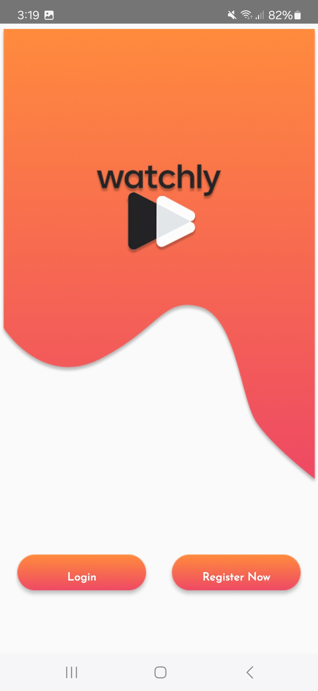
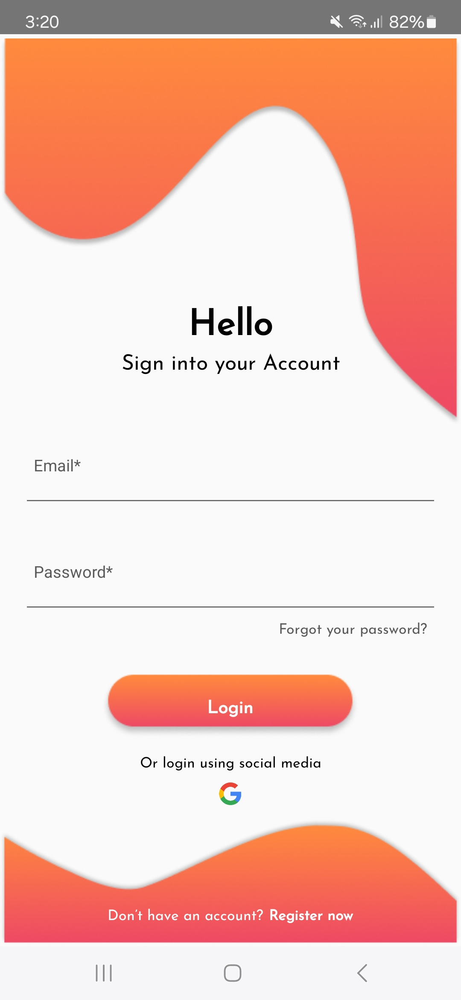
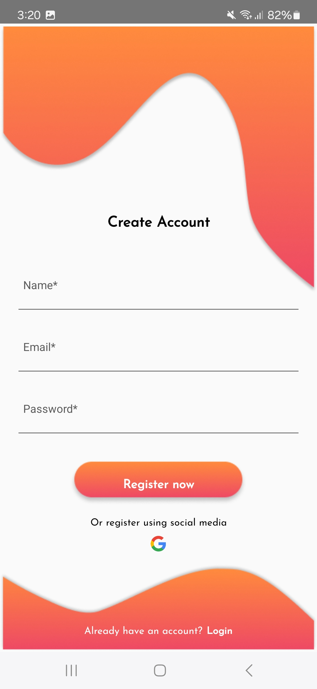
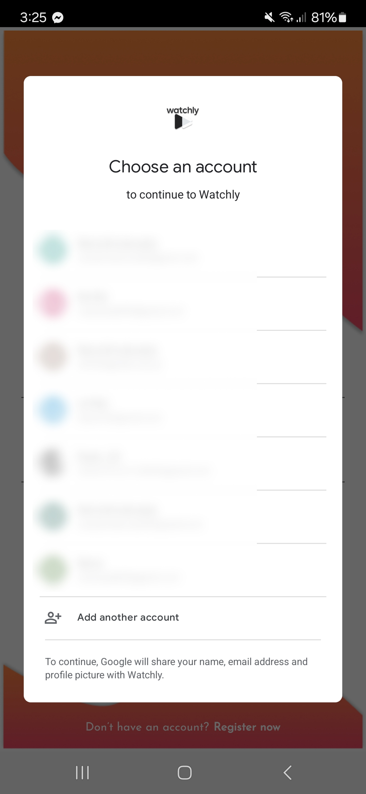
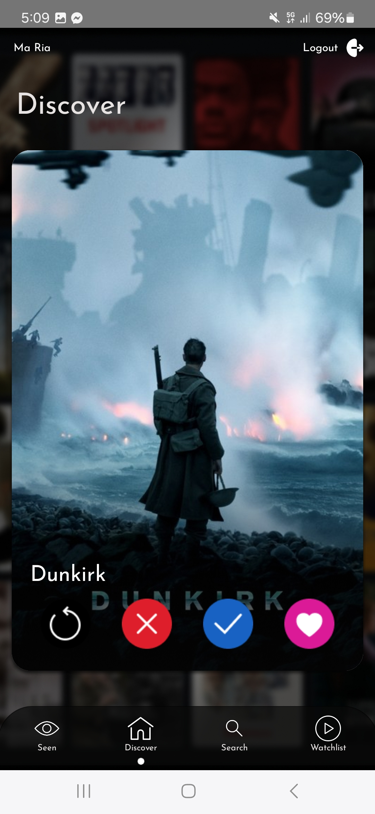
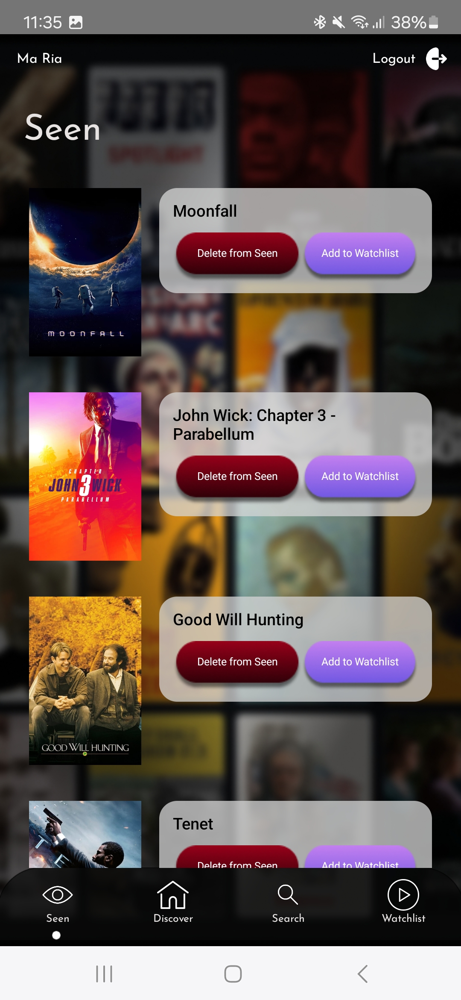
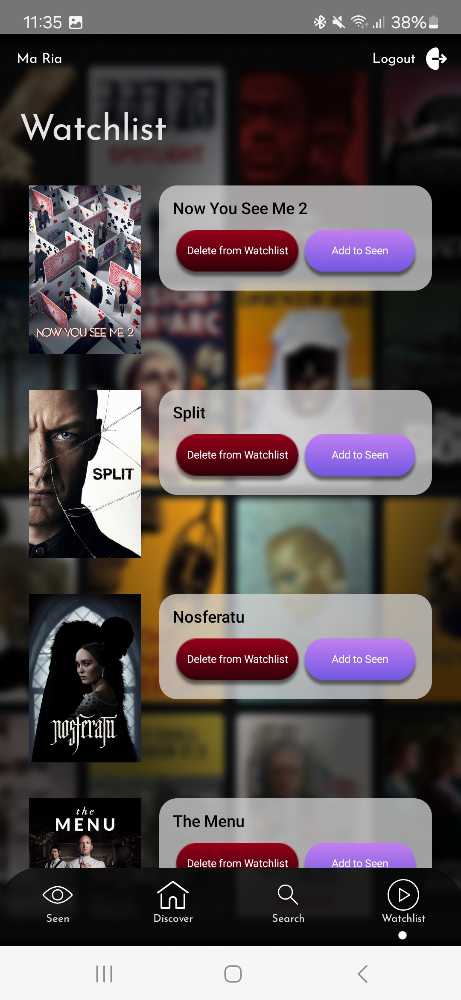
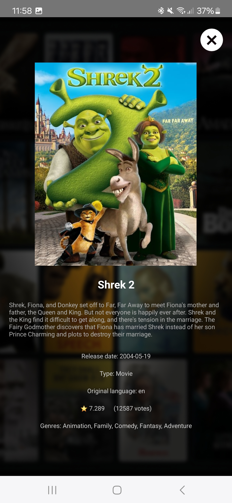

  
  <h1>Watchly</h1>

Watchly is an Android app designed to help users discover, organize, and store a personalized list of movies and TV shows. The app integrates with the **TMDb API** to fetch up-to-date movie data, while storing user preferences (watched, to-watch lists) in **Firebase Firestore**. Additionally, the app provides user authentication through both Google and email, an intuitive swipe interface and advanced search filters for an enhanced movie discovery experience.

---

## 🌟 Features

### 🔐 Authentication

- **Email & Password Authentication**: Users can easily create an account or log in using their email and password.
- **Google Login Integration**: Users can sign in with their Google account for faster authentication.

|  |  |  |  |
| ---------------------------- | -------------------------- | ----------------------------- | ----------------------------------- |

### 🎞️ Discover page

The **Discover Screen** displays a dynamic set of **random popular movies** fetched from the TMDb API. This screen allows users to:

- **Swipe through movie cards**: Each card shows basic movie information such as the title, poster, and average rating.
  - 👈 **Skip**: Swipe left to skip the movie.
  - 👉 **Add to Watchlist**: Swipe right to add the movie to your **Watchlist**.
  - ✅ **Mark as Watched**: Click button to mark the movie as **Seen**.
  - ⬅️ **Return to Previous Movie**: Click button to return to the previously shown movie.
- The swipe interface makes it easy to navigate through a large collection of movies without feeling overwhelmed.

This interactive and visually engaging **swipe card UI** is designed to offer an enjoyable and seamless movie discovery experience.

  

    
<strong>📸 Screenshot: Main Screen</strong>

    
  

  

    
<strong>➡️ Browsing Movies – Using Buttons</strong>

    <video width="200" autoplay muted loop>
      <source src="https://github.com/user-attachments/assets/7259b15b-3726-4dbe-bfe9-5a5c5d3e7fcd" type="video/mp4" />
    </video>
https://github.com/user-attachments/assets/7259b15b-3726-4dbe-bfe9-5a5c5d3e7fcd

  

  

    
<strong>👆 Browsing Movies – Swiping Cards</strong>

    <video width="200" autoplay muted loop>
      <source src="screenshots/discover_swipe.mp4" type="video/mp4" />
    </video>
  

### ✅ Seen Screen

The **Seen Screen** displays movies that the user has already watched. This screen helps you keep track of your viewing history. Features include:

- **Detailed view**: Tap on any movie to see more information, including the plot and reviews.
- **Move to Watchlist**: If you change your mind and decide to watch a movie again later, you can move it back to the **Watchlist**.
- **Remove from List**: Users can remove a movie from the **Seen** list if they no longer want to keep it.

  

    
<strong>📸 Screenshot: Seen Screen</strong>

    
  

  

    
<strong>Browsing Watched Movies</strong>

    <video width="250" autoplay muted loop>
      <source src="screenshots/seen.mp4" type="video/mp4" />
      Your browser does not support the video tag.
    </video>
  

### 🕒 Watchlist Screen

The **Watchlist Screen** is where you store movies that you plan to watch later. This screen is essentially your personal movie queue. Key features include:

- **Movie Details**: Each movie in the list shows basic information, including a poster, genre and average rating.
- **Move to Seen**: Once you've watched a movie, you can easily move it from the **Watchlist** to the **Seen** list.
- **Remove from List**: Users can remove movies from their Watchlist if they change their mind about watching them.

  

    
<strong>📸 Screenshot: Watchlist Screen</strong>

    
  

  

    
<strong>Browsing Movies To Watch</strong>

    <video width="250" autoplay muted loop>
      <source src="screenshots/watchlist.mp4" type="video/mp4" />
      Your browser does not support the video tag.
    </video>
  

### 🔎 Search Screen

The **Search Screen** allows users to search for movies or TV shows. Features include:

- **Search by Title**: Find movies or TV shows based on their title.
- **Filter by**:
  - **Type**: Choose between _All_, _Movie_ or _TV Show_.
  - **Genre**: Select specific genres (e.g., Action, Drama, Comedy).
  - **Language**: Filter by language to find content in the desired language.
- **Sort by**:
  - **Popularity**: Sort movies by how popular they are.
  - **Release Date**: Sort by release date to find the newest movies.
  - **Rating**: Sort by movie rating to find the highest-rated content.
- **Add to Watchlist or Seen**: You can easily add search results to either the **Watchlist** or **Seen** lists.

  

    
<strong>Advanced filtering</strong>

    <video width="200" autoplay muted loop>
      <source src="screenshots/search_filters.mp4" type="video/mp4" />
      Your browser does not support the video tag.
    </video>
  

  

    
<strong>Searching by title</strong>

    <video width="200" autoplay muted loop>
      <source src="screenshots/search_title.mp4" type="video/mp4" />
      Your browser does not support the video tag.
    </video>
  

  

    
<strong>📸 Screenshot: Details</strong>

    
  

---

## 🛠️ Built With

The following technologies were used to build the app:

- **Java** – the programming language.
- **Android Studio** – the development environment used to build the app.
- **TMDb API** – a rich source of movie and TV show data, including details like plot summaries, ratings and posters.
- **Firebase Firestore** – cloud database service to store and sync user data, such as the **Watchlist** and **Seen** lists.
- **Firebase Authentication** – provides authentication mechanisms for logging in with either email or Google.
- **Glide** – a popular image loading library for efficiently loading and displaying movie posters.
- **Retrofit** – a powerful library used to make network requests to the TMDb API.
- **Swipe Cards Library** – "com.lorentzos.swipecards:library" is used for implementing the swipeable card UI.

---
